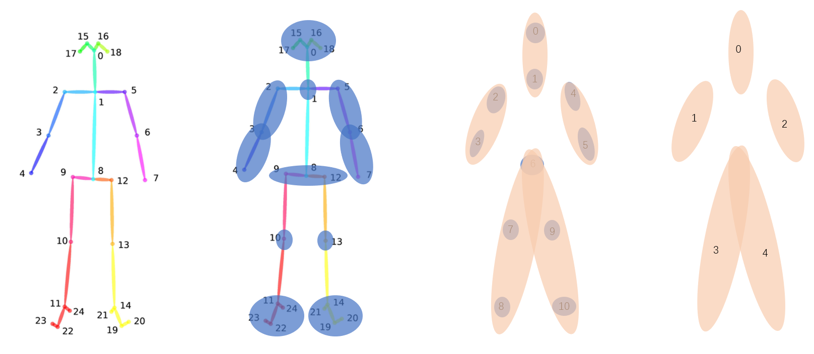

# 基于飞桨实现花样滑冰选手骨骼点动作识别
> 从 [paddlepaddle](https://www.paddlepaddle.org.cn/) 框架下的 [PaddleVideo](https://github.com/PaddlePaddle/PaddleVideo) 中基于 ST-GCN 的 baseline 出发

## 任务背景

花样滑冰与其他运动项目相比，其动作类型的区分难度更大，这对识别任务来说是极大的挑战。对于花样滑冰动作识别任务，主要难点如下：花样滑冰运动很难通过一帧或几帧图像中的人物姿态去判断动作类别；花样滑冰相同大类、不同小类的两个动作类别仅存于某几帧的细微差异，判别难度极高。然而，其他帧的特征也必须保留，以便用于大类识别以及“多义帧”处理等情况。

基于现实场景的应用需求以及图深度学习模型的发展，本次比赛旨在通过征集各队伍建立的高精度、细粒度、意义明确的动作识别模型，探索基于骨骼点的时空细粒度人体动作识别新方法。本次比赛将基于评价指标Accuracy对各队伍提交结果的评测成绩进行排名，Accuracy得分越高，则认为该模型的动作识别效果越好。

1. 类别定义：

花样滑冰动作包括3个大类，分别为跳跃、旋转和步法，每个大类又包含很多小类。例如，跳跃大类包含：飞利浦三周跳（3Filp）和勾手三周跳（3Lutz）2个小类。然而，这2类跳跃的判别性仅在于一些个别帧的差异。此外，如果想就跳跃小类（3Filp或3Lutz）与旋转小类进行区别，对大部分帧的特征加以使用才能产生较好的判别性。

2. 多义帧：

花样滑冰动作不同类别中相似的帧，甚至存在个别帧的特征相同等情况。

3. 具体任务：

参赛选手利用比赛提供的训练集数据，构建基于骨骼点的细粒度动作识别模型，完成测试集的动作识别任务。模型识别效果由指标Accuracy排名决定，Accuracy得分越高，则认为该模型的动作识别效果越好。

## 数据背景

本次比赛数据集旨在借助花样滑冰选手的视频图像研究人体运动。由于花样滑冰选手动作切换速度十分迅速，如希望准确判断一个动作的类别，只靠随机抽取的几帧很难出色地完成任务。

尽管目前人体运动分析研究领域主流的视频数据集较多，规模也较大，如视频识别数据集：Kinetics、 Moments in Time、UCF101等，视频分割数据集：Breakfast、Epic Kitchens、Salads50等。然而，以上数据集大多缺乏人体运动的特性（Kinetics有部分运动特性，但不够专业，且类别有限）。举例来看，若对UCF101数据集选取子集，遮挡住数据中人物并留下场景，目标检测结果的准确率仅下降较小幅度，这说明该视频数据不太关注人的运动，也无法体现视频分析的特性。相比之下，本次比赛数据集旨在借助花样滑冰选手的视频图像研究人体运动。在花样滑冰运动中，人体姿态和运动轨迹相较于其他运动呈现出复杂性强、类别众多等特点，有助于开展对细粒度图深度学习新模型、新任务的研究。

在本次比赛最新发布的数据集中，所有视频素材均从2017-2020 年的花样滑冰锦标赛中采集得到。源视频素材中视频的帧率被统一标准化至每秒30 帧，图像大小被统一标准化至1080 * 720 ，以保证数据集的相对一致性。之后通过2D姿态估计算法Open Pose，对视频进行逐帧骨骼点提取，最后以.npy格式保存数据集。

训练集 x.npy 尺寸为 [2922, 3, 2500, 25, 1], 包含 2922 个样本，每帧的 skeleton pose 由二维的 25 个关节点构成，第三维是 openpose 检测结果的置信度，其中运动序列虽然统一长度为 2500 帧，但不同序列真正有意义的帧长是各不相同的，其余帧全部用 0 补全。 A / B 榜测试集样本数分别为 628/634。最终要求输入一组运动序列，对其进行三十分类。

## 赛况

A 榜榜首为 基于[商汤 MMAction](https://github.com/open-mmlab/mmaction2) 的 73.5669，而官方 AGCN baseline 为 62.5796. 

在探索过程中，发现模型在训练集达到 100，而测试集只有 50多。考虑到训练集样本数，很明显，其他人是在其他数据集上做了训练。而我时间不充分了。

## 思路

考虑到数据样本有意义的帧长不统一，Andy 给出的方案是根据最短帧长确定 segment，对过长序列每一个 segment 内部随机挑选。而对测试集，则将多次随机组合而成的样本输出进行平均。

鉴于 DCT 在运动序列的压缩上有很大的威力，我将 2500 帧统一经过 DCT 保留低频的 30 对系数。这样既考虑到完整帧序列，又压缩了模型大小。

为了同时考虑粗粒度与细粒度的信息，设计了 Unet-Like 的 multi-scale 架构。

## 遗憾

遗憾在于只有两三天的时间，来不及在更多多大其他数据集上进行训练。也来不及探索 MMAction2 等方法。

